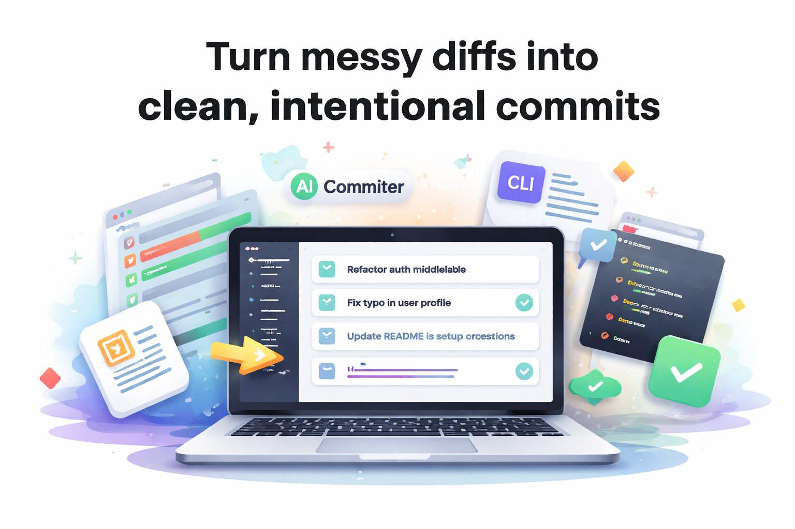
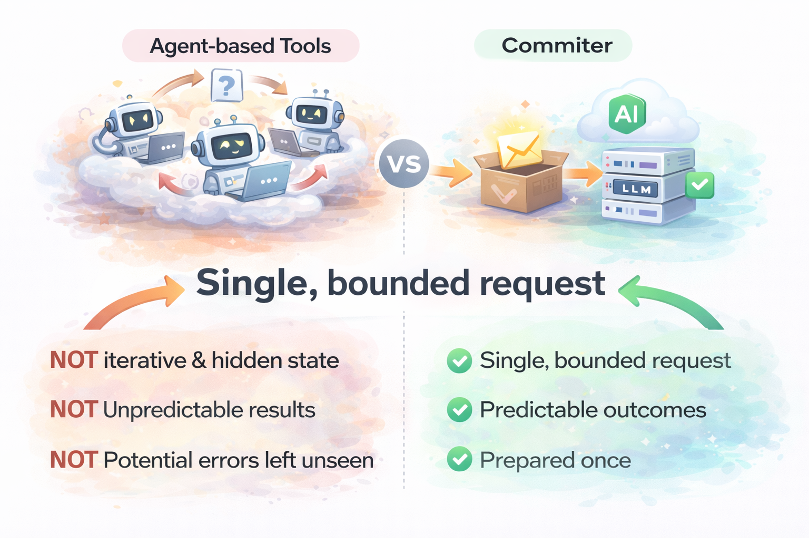

# Commiter



**Turn messy diffs into clean, intentional commits — once, with confidence.**

`commiter` is a CLI that analyzes your git diffs, plans **semantic commit units**, and applies them in order after a single confirmation.

It supports **OpenAI** and **AWS Bedrock** models, sends only _locally collected diff context_ to the LLM, and anchors every plan to your existing commit history — so your style stays yours.

---

## The problem `commiter` solves

Good commits are not about polish — they are about **operability**.

When commits are clear and scoped:

- intent survives long after context is gone
- reverts and cherry-picks are safe instead of stressful
- broken builds are traced faster
- automation (changelogs, audits, metrics) becomes reliable

But writing those commits by hand — especially from messy diffs — is slow, error-prone, and mentally expensive.

`commiter` exists to remove that friction **without taking control away from you**.

---

## Why not an agent?



Most agent-based tools optimize for autonomy.
`commiter` optimizes for **predictability**.

- **Single, bounded request**
  All diffs and metadata are prepared locally and sent once.
  No iterative prompting, no hidden state.

- **Commit plans are artifacts**
  Generate a plan, save it as JSON, review it, regenerate it with another model, or apply it later.
  Nothing is ephemeral.

- **Your commit style, enforced**
  Recent commit messages are passed as context so tone and structure stay consistent — no prompt tuning required.

- **Strict safety guarantees**
  Every hunk ID is validated.
  Duplicates, missing assignments, or unknown hunks are detected and isolated instead of silently dropped.

You decide _what_ happens.
The LLM only helps decide _how to group it_.

---

## Key features

- Detects staged and unstaged changes and splits diffs into **hunk-level units**
- Generates a commit plan via OpenAI or Bedrock and validates it against a strict JSON schema
- Automatically repairs common LLM failures:

  - duplicate hunk assignments
  - missing or invalid references
  - illegal groupings

- Shows a per-commit summary (files, added/removed lines) **before** anything is applied
- Saves commit plans as JSON (`--save-plan`) for review, CI artifacts, or later reuse
- Applies only intended hunks via `git apply --cached`, preventing accidental cross-file commits

---

## Quick start

### 1) Requirements

- Node.js 20+
- pnpm
- A git repository

### 2) Install & build

```bash
pnpm install
pnpm build
```

### 3) Configure environment variables

```bash
export LLM_PROVIDER=openai          # or bedrock
export OPENAI_API_KEY=sk-...
export OPENAI_MODEL=gpt-5-mini      # optional (default provided)
```

_(For Bedrock: set `BEDROCK_REGION`, `BEDROCK_MODEL`, `BEDROCK_BASE_URL`, etc.)_

### 4) Run

```bash
# Default commit flow (command name comes before flags)
pnpm start -- commit --save-plan --out plan.json

# Using installed binaries
commiter commit --save-plan
co c --out plan.json
```

### 5) What you’ll see

1. A diff summary
2. A generated commit plan
3. A confirmation prompt
4. Commits applied one by one, in order

---

## How it works

1. Reads `git diff` and builds structured metadata per file and hunk
   (including capped previews of changed lines for safety)
2. Feeds recent commit messages to the model to anchor tone and format
3. Validates the response against a strict JSON schema
4. Repairs common failures:

   - removes unknown hunks
   - deduplicates assignments
   - isolates unassigned hunks into a warning commit

5. Executes the final plan:
   `git apply --cached` → `git commit`, sequentially

The outcome is **reviewable, reproducible, and boring in the best way possible**.

---

## Scripts

- `pnpm build` — Build TypeScript and resolve path aliases
- `pnpm start -- <args>` — Run the built CLI
- `pnpm lint` — Run lint checks

---
